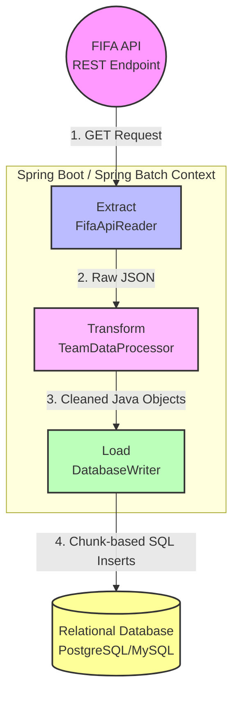

# 🏆 FIFA World Cup Data Pipeline

A robust, enterprise-grade Data Engineering pipeline built in Java. This monolithic application uses **Spring Boot** and **Spring Batch** to extract, transform, and load (ETL) data from the FIFA World Cup API into a relational database for further analytics.

## 🏗️ Architecture & Data Flow

This project implements a classic ETL pattern managed entirely within the Java Virtual Machine (JVM) using Spring Batch.

### Architecture Diagram



### 🔄 How the Data Flows

1. **Extract (`src/.../extract`)**:
    - A Spring Batch `ItemReader` connects to the API (`https://worldcup26.ir/get/teams`) via Java's native `HttpClient`.
    - It handles HTTP connections, timeouts, and Spring Batch manages automatic retries if the API is temporarily unavailable (e.g., HTTP 500 errors).
    - *Output:* Raw JSON data.

2. **Transform (`src/.../transform`)**:
    - A Spring Batch `ItemProcessor` receives the raw JSON.
    - It uses Jackson to parse the JSON tree, navigates to the `"teams"` array, and maps the unstructured data into strictly typed Java POJOs/Records (`ProcessedTeam`).
    - During this step, data validation, null-handling, and field standardization (like standardizing country codes) occur.
    - *Output:* A stream of clean, validated `ProcessedTeam` objects.

3. **Load (`src/.../load`)**:
    - A Spring Batch `ItemWriter` collects the processed objects into "chunks" (e.g., 50 or 100 records at a time).
    - Once a chunk is full, it executes a single, highly efficient Batch SQL `INSERT` to load the data into the target database.
    - *Output:* Persistent data ready for analytics.

## 💻 Technology Stack

* **Language:** Java 17+
* **Framework:** Spring Boot 3.x
* **Data Engineering/ETL:** Spring Batch
* **JSON Processing:** Jackson
* **Database Access:** Spring Data JPA / JDBC
* **Target Database:** PostgreSQL (Recommended)

## 📁 Project Structure

```text
fifa-data-pipeline/
├── pom.xml
└── src/
    ├── main/java/com/fwcanalytics/
    │   ├── App.java                   # Application Entry Point
    │   ├── config/                    # Spring Batch & Scheduler Configuration
    │   ├── models/                    # Data Structures (POJOs/Records)
    │   ├── extract/                   # API Integration (ItemReader)
    │   ├── transform/                 # Data Cleaning (ItemProcessor)
    │   └── load/                      # Database Insertion (ItemWriter)
    └── test/                          # Unit & Integration Tests
```

## 🚀 Getting Started

*(Instructions for setting up the local environment, database schema, and running the Spring Boot application will go here).*